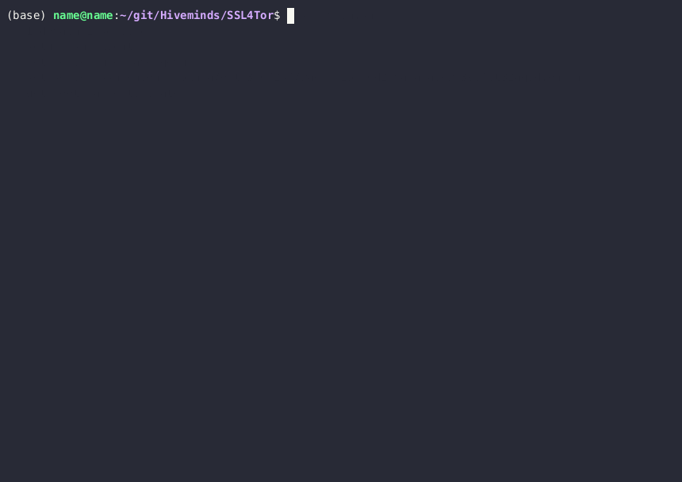
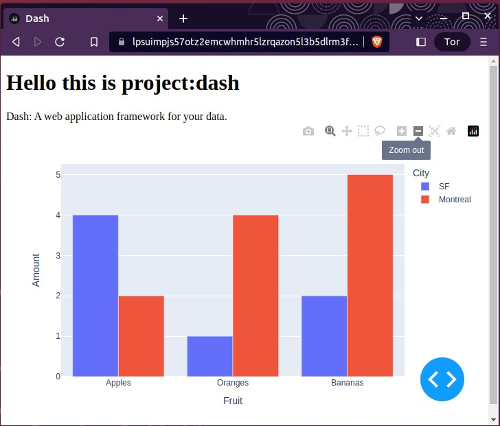

# Self-signed SSL for https onion urls

[](https://www.gnu.org/licenses/agpl-3.0)

Create your own <httpS://example31415926535.onion> websites, with your own
self-signed https certificates, **in a single command**.

- A bit\* like Let's Encrypt, except for onion domains.
- A bit\* like [Harica, except free](https://news.harica.gr/article/onion_announcement/).
- A bit\* like [Digicert for Facebook](https://www.digicert.com/blog/anonymous-facebook-via-tor),
  except for everyone.

\*The difference being that all those services are in the "trusted" list
of all of your computers, phones and browsers, whereas your own certificate is
not. That is why this project also adds your own root CA to those trusted
lists.

## Set up 2 onion domains and SSH on server


## Get the root CA and set up passwordless ssh into server



## Usage

Clone this repo on 2 devices;

- **server** - a regular computer with Ubuntu, will host your onion websites
- **client** - access the onion websites from this device

### Setup Server

You can create 3 https onion domains, for 2 services, and an ssh access into
the server, with:

```bash
./src/main.sh \
  --delete-onion-domain \
  --delete-projects-ssl-certs \
  --delete-root-ca-certs \
  --firefox-to-apt \
  --services 443:gitlab:443/9001:dash:9002/22:ssh:22 \
  --ssl-password somepassword \
  --get-onion-domain
```

This creates an ssh tunnel, and 2 dash plots that you can visit:

- Inside the (Qemu) server at:
  - [https:127.0.0.1:8050](https:127.0.0.1:8050)
  - [https:127.0.0.1:9001](https:127.0.0.1:9001)
- From anywhere in the world, using Brave or the Tor browser at:
  - [https://\<first_onion_url>.onion:8070](https://%3Cfirst_onion_url%3E.onion:8070)
  - [https://\<second_onion_url>.onion:9002](https://%3Csecond_onion_url%3E.onion:9002)

This is the default service that is created on your onion domain:



## Get your public root ca certificate

You now have self-signed your SSL certificates for your onion domain(s) on your server.

Since it is not standard that you as a user have the authority to be an
authority, you have to tell your devices to respect your new authority. This is
done by adding your self-signed root ca (`ca.crt`) to your browser, or even
computer. This is automated for you. You need the:

- Ubuntu username of your server.
- ssh onion of your server (shown in that last green line of the server setup gif).

Then run this on your client:

```bash
./src/main.sh \
 --1-domain-1-service \
 --setup-ssh-client \
 --get-root-ca-certificate \
 --set-server-username <Ubuntu username of your server> \
 --set-server-ssh-onion <server ssh onion>.onion
```

## Passwordless SSH into server

As a side affect, you can now ssh into your server, from anywhere in the world,
safely and passwordless:

```bash
torsocks ssh ubuntu_username@31415926535abc...onion
```

(It uses your unique, private & public ssh-key pair for authentication.)

## Developer Requirements

(Re)-install the required submodules with:

```sh
chmod +x install-bats-libs.sh
./install-bats-libs.sh
```

Install:

```sh
sudo gem install bats
sudo apt install bats -y
sudo gem install bashcov
sudo apt install shfmt -y
pre-commit install
pre-commit autoupdate
```

### Pre-commit

Run pre-commit with:

```sh
pre-commit run --all
```

### Tests

Run the tests with:

```sh
bats test/*
```

### Code coverage

```sh
bashcov bats test
```

### CLI recorder

To update the two gifs in the above Readme, use:

```bash
./src/main.sh --record-cli ~/server
./src/main.sh --record-cli ~/client
```

To get the `server.gif` into your *client*, set up the server in qemu and
ssh-copy it from your client with:

```bash
./src/main.sh \
 --setup-ssh-client \
 --set-server-username <Ubuntu username of your server> \
 --set-server-ssh-onion <server ssh onion>.onion \
 --get-server-gif
```

### Starting QEMU (Optional)

Using qemu is not necessary, but it is a nice sandbox to give this code a try,
keeping your own system nice and clean.

One can create an Ubuntu 22.10 virtual machine in qemu with:

```sh
# Download the ubuntu-22.04.2-desktop-amd64.iso into this directory.
wget https://releases.ubuntu.com/jammy/ubuntu-22.04.2-desktop-amd64.iso

# Create the image in which the Ubuntu 22.04 VM will be created.
qemu-img create ubuntu22.img 30G

# Create the Ubuntu 22.10 Ubuntu image.
qemu-system-x86_64 \
 --enable-kvm \
 -m 1024 \
 -machine smm=off \
 -cdrom $PWD/ubuntu-22.04.2-desktop-amd64.iso \
 -boot order=d ubuntu22.img

# Now manually install Ubuntu (TODO: automate, perhaps using OEM).
```

And then run Ubuntu 22.04 in a sandbox on your device with:

```sh
qemu-system-x86_64 --enable-kvm -m 4096 -machine smm=off -boot order=d \
  ubuntu22*.img -smp 4 \
  -chardev qemu-vdagent,id=ch1,name=vdagent,clipboard=on \
  -device virtio-serial-pci \
  -device virtserialport,chardev=ch1,id=ch1,name=com.redhat.spice.0
```

Then press `Ctrl+Alt+G` to capture the keyboard (and mouse).

## Help

Feel free to create an issue if you have any questions :)

## How to help

An quick and easy way to contribute is to:

- Reduce the output of the (main) script, make it more simple/silent.

And if you like this project, feel free to:

- Pick an issue and fix it.
- Create support for Windows and/or Mac.
- Improve the test-coverage by writing more (meaningful) tests.
- Move the developer instructions into a separate documentation, similar
  to: <https://bats-core.readthedocs.io/en/stable/>
- Help make this repository Readme more simple. (To me this makes sense, but
  perhaps to a new person coming into this some context is missing. And I
  believe less is more in this case.)
